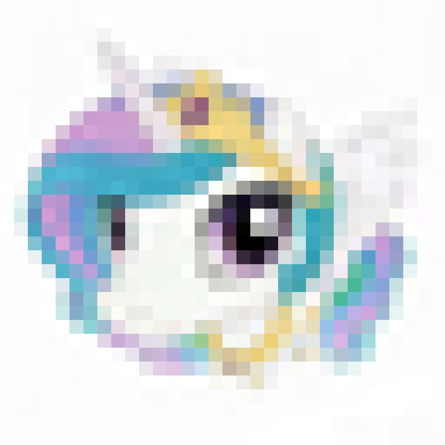

# Photo to Beads

一个把照片转换成拼豆图纸的小工具。

## 项目目标

这个项目希望把普通照片转换成适合拼豆制作的像素图纸，帮助用户快速生成可以照着摆放的拼豆设计。

## 计划功能

- 上传一张照片
- 设置图纸大小，比如 32 x 32、48 x 48
- 将照片转换成像素风格
- 自动减少颜色数量
- 生成拼豆格子图
- 统计每种颜色需要多少颗拼豆

## 技术计划

初期使用 Python 开发：

- Pillow：处理图片
- NumPy：处理颜色和像素数据
- Matplotlib 或 PIL：导出图纸图片

后续可能做成网页版本：

- 上传图片
- 在线预览拼豆图纸
- 导出 PNG / PDF

## 当前进度

- [ ] 创建项目仓库
- [ ] 完成基础图片缩放
- [ ] 完成颜色简化
- [ ] 生成第一版拼豆图纸
- [ ] 添加颜色统计

## 为什么做这个项目

我想把照片变成可以实际手工制作的拼豆图纸，让编程和手工创作结合起来。

## Example

Input photo:

Output pixel art:

